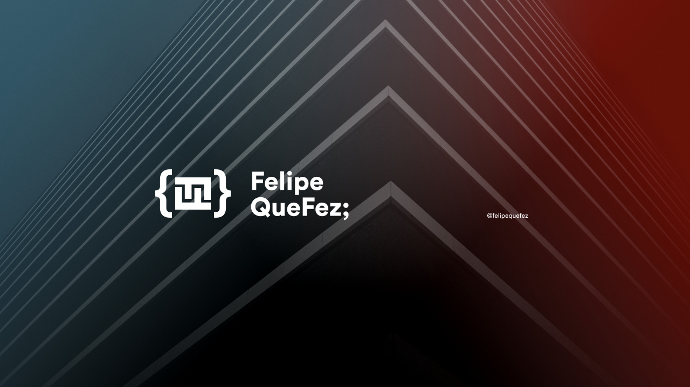

<kbd></kbd>

 

- I am Felipe Augusto and I make youtube videos: [FelipeQueFez](https://www.youtube.com/channel/UCcSBSVYhCgspV5-oQ24T5ow)! My goal is to help people learn how to code in an entertaining way. 
- I have worked with Flutter and Dart since 2018 and I am now a Flutter Developer at Code Factory. 

  
  
  
  

 

